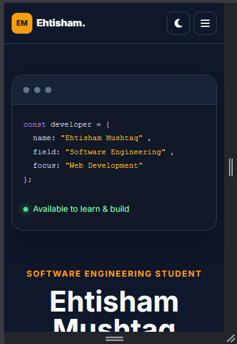
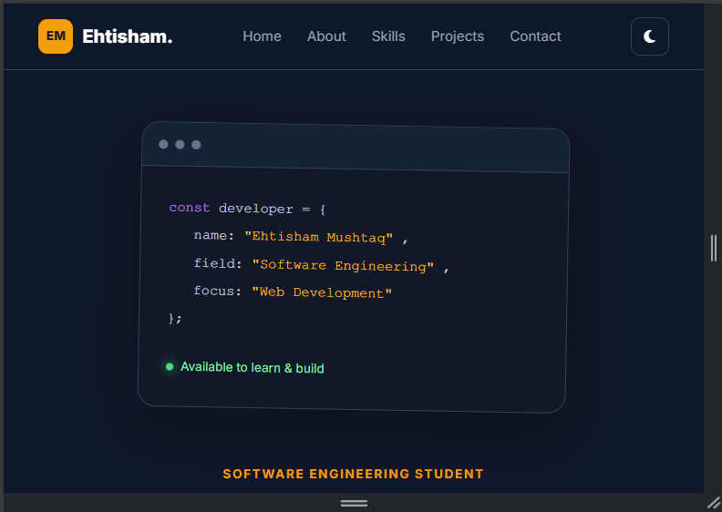
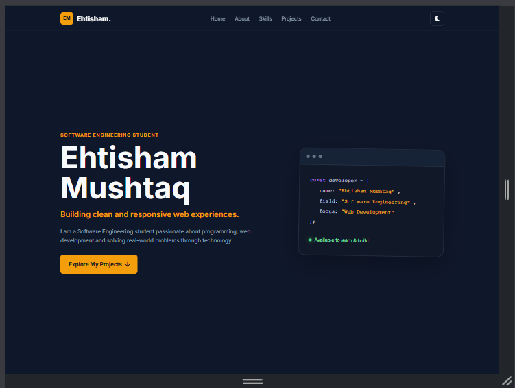

# Ehtisham Mushtaq — Personal Portfolio

A responsive single-page personal portfolio website built as **The Sky Gen Web Development Project 01**.

The website presents my profile, technical skills, academic projects, contact information and downloadable CV through a clean, responsive and interactive interface.

## Live Website

**Live URL:**  
https://ehtisham-mushtaq.github.io/tsg-webdev-p01-EhtishamMushtaq/

## GitHub Repository

**Repository:**  
https://github.com/Ehtisham-Mushtaq/tsg-webdev-p01-EhtishamMushtaq

---

## Project Objective

The objective of this project is to build a complete professional personal portfolio website using HTML5, CSS3 and vanilla JavaScript.

The project demonstrates semantic HTML structure, responsive layouts, CSS Flexbox, CSS Grid, JavaScript interactions, form validation, Git/GitHub workflow and deployment of a static website.

---

## Features

- Sticky responsive navigation bar
- Smooth scrolling between sections
- Professional hero section
- Personal introduction and about section
- Downloadable CV
- Six technical skills with icons and proficiency indicators
- Three academic project cards
- Responsive contact form
- JavaScript form validation
- Mobile navigation menu
- Dark/light mode switch
- Scroll-to-top button
- CSS hover effects
- Responsive design for mobile, tablet and desktop
- Public GitHub repository
- Live deployed website

---

## Sections

### Home

Introduces my profile, professional tagline and primary call-to-action.

### About

Contains a short professional biography and a downloadable CV.

### Skills

Displays my current technical skills with icons and proficiency indicators.

### Projects

Showcases three academic projects:

1. Freelancer & Client Management System (FCMS)
2. Library Management System
3. Custom Craft

### Contact

Contains a validated contact form, email address, location information and social links.

### Footer

Contains copyright information and social media links.

---

## Technologies Used

- HTML5
- CSS3
- CSS Flexbox
- CSS Grid
- JavaScript ES6
- Google Fonts
- Font Awesome
- Git
- GitHub
- GitHub Pages

---

## JavaScript Features

The website includes the following JavaScript functionality:

### 1. Mobile Menu Toggle

The navigation menu can be opened and closed on smaller screens.

### 2. Dark/Light Mode

Users can switch between dark and light themes.

The selected theme is stored in browser local storage.

### 3. Scroll-to-Top

A scroll-to-top button appears after the user scrolls down the page and smoothly returns the user to the top.

### 4. Contact Form Validation

The form validates:

- Name
- Email format
- Message length

and displays appropriate validation messages.

---

## Responsive Design

The website was tested at the required viewport widths:

- **360px** — Mobile
- **768px** — Tablet
- **1440px** — Desktop

The layout is designed to avoid horizontal scrolling across these screen sizes.

---

## Screenshots

### Mobile — 360px



### Tablet — 768px



### Desktop — 1440px



---

## Project Structure

```text
tsg-webdev-p01-EhtishamMushtaq/
│
├── index.html
├── README.md
│
├── css/
│   └── style.css
│
├── js/
│   └── script.js
│
├── assets/
│   ├── docs/
│   │   └── cv.pdf
│   │
│   └── images/
│       ├── fcms.svg
│       ├── library-management.svg
│       └── custom-craft.svg
│
└── screenshots/
    ├── mobile.png
    ├── tablet.png
    └── desktop.png